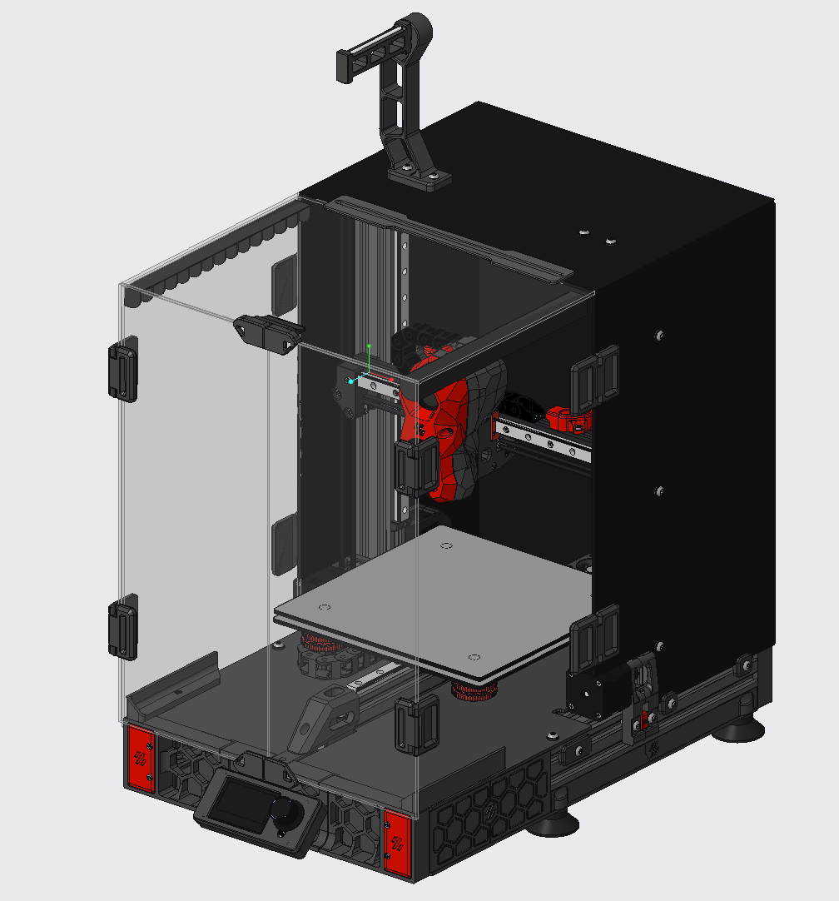

# Parts Collection

This is a collection of parts to make the DarkDog Rev2 Ender_SW compatible with the 2040 Y Extrusion of the original Ender.

Based on Gizzles Y-Axis https://github.com/VoronDesign/VoronUsers/tree/master/printer_mods/Gizzle/ender-3_(pro)_switchwire
  - The Motormount and chainmount are untouched the rest is redesigned for easier mounting with existing ender hardware and also added a tensioner for the belt.
  - There is an option to not drill the bed carriage plate and use the drillless bed carriage adapter (Folder Y-Axis -> Drilless Carriage) 

And DarkDogs Rev2 https://github.com/boubounokefalos/Ender_SW/tree/Rev.2
  - Most Parts of DarkDogs Rev2 are untouched (Get them from his Repo) and only a few edited files to make them fit (Check the table below)
  - My Y tensioner is based on DarkDogs desgin but completely redone to fit the 2040 extrusion and orientation of the belt.

There are mounts for the original PSU, the thick non-meanwell one.
It is advisable to not use a lower panel then (or create a cutout), as the psu fan is very close to the panel.

# Overview of changes:

- Y-axis extrusion moved forward one bolt hole with replacing one M5 bolt with shorter one and using a t-nut in the extrusion.
  35mm bolts are bit too long depending on how the extrusions are machined, so use some washers under the bolt head till the bolts 
  does not hit the bottom of the extrusion.
- Modified Skirt to hold PSU, added Parts when using original PSU.
- Modified Rear Grill make room for the Y Motor (Support is needed for this part)
- Located Pi to the front (less room in the back because of the vertical stepper), but you can get creative with electronics mounting/layout.
- Added a Y-Belt-Tensioner to the idler, similiar to DarkDogs desgin but completely redesigned to fit the 2040 extrusion and belt orientation
  You need to tap a M5 thread into the 2040 Y-Extrusion to mount the Y-Belt-tensioner. I simply used a cordless power drill and let the screw tap the thread itself since the aluminium is pretty soft.
  If you have a M5 Tap onhand using that is clearly the better method!

Majority of STL-Files are still from the DarkDog Conversion (boubounokefalos), basically everything except the Y-Axis Folder (Gantry -> Y-Axis Folder) and a few changed files (See table below)
https://github.com/boubounokefalos/Ender_SW/tree/main/STLS

You can use drill-less carriage adapter as drill template or simply use the drill-less files.
You may have to use shorter bed springs/silicone spacers then, as the bed is raised about 8mm and can interfere with the lower z rail stops. There are smaller z_endstop files in the folder to reduce the problem as best as possible.

You may want to use the optimized motor mounts: https://github.com/strayr/SWE3-motor-mounts
They add a third screw to the frame to avoid tilting of the assembly.

Watch the Table down to see which files replace the DarkDogs files:
# Table of Parts to use instead of DarkDog files

| Part                                       | Original              | Replace with:                                   | Comment:                                                   |
|--------------------------------------------|-----------------------|-------------------------------------------------|------------------------------------------------------------|
| Grill                                      | rear_grill_middle     | rear_grill_middle_nonpro                        |                                                            |
| Extension/Side Skirt                       | rear_extention_left_a | rear_extention_left_a_psu                       | Also replaces the PS_4040_Slide_Mount as mount for the psu |
| Deck Upper Side                            | deck_panel_left.dxf and [...] right.dxf| deck_upper_non_pro             | Also available as dxf, Make sure you get it mirrored when getting cut if the material has two surface finishes (eg. glossy and structured)
| Rear Panel                                 | rear_panel            | rear_panel_non_pro                              | Also available as dxf                                      |
|--------------------------------------------|-----------------------|-------------------------------------------------|------------------------------------------------------------|
| If using the original thick PSU:           |                       |                                                 |                                                            |
|--------------------------------------------|-----------------------|-------------------------------------------------|------------------------------------------------------------|
| PSU Mount                                  | PS_4040_mount_x2      | 2x orig_psu_mount                               |                                                            |
| Extension:                                 | rear_extention_left_a | extension_left_a_orig_psu                       |                                                            |

If there are any questions/erros you can ping me in the ender_conversion_chat of the voron discord.
Cheers! 

# BOM 
RobotRogue did a great job creating a BOM for the Conversion: 
https://github.com/RobotRogue/Enderwire_Docs

For the Non-Pro you need one less linear rail (4 instead of 5).
For Y Idler / Tensioner you need a M3x25mm screw and nut, as well as a M5x20mm screw for the bearing stack.
